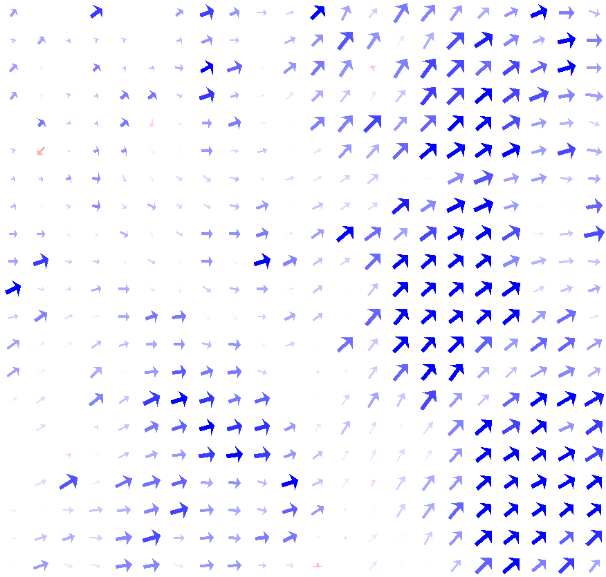
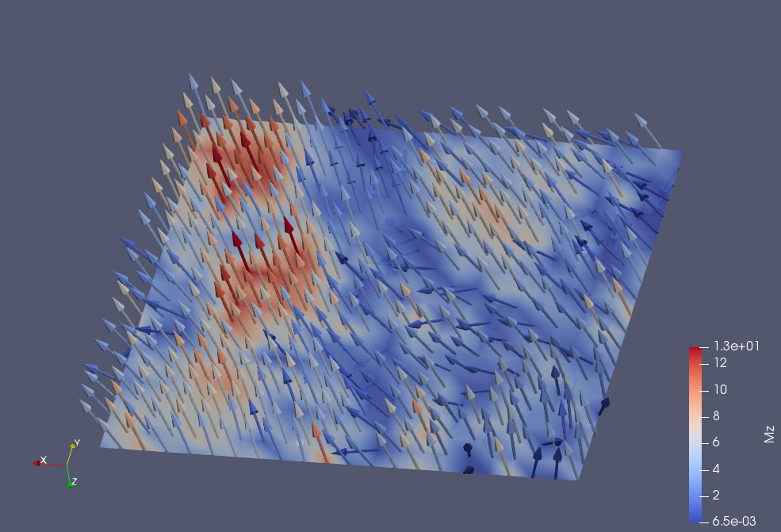

# 3D-image-reconstruction-of-XPEEM-images
This code analyzes the XPEEM images and extracts the magnetization components. The values are then converted into .svf or .vtk format 
to vizualize in OOMF micromagnetics or Paraview.
Example of OOMF:  
 
Example of VTK:  
 
